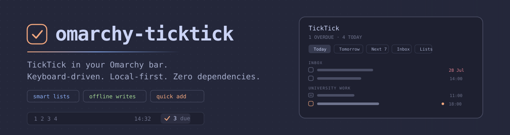
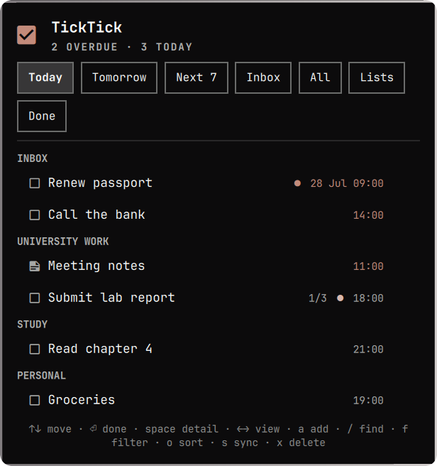
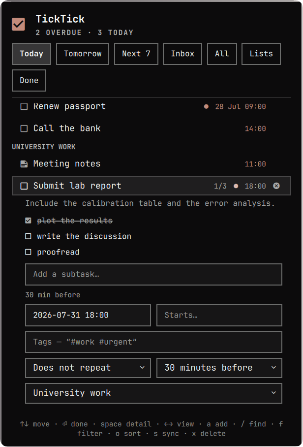
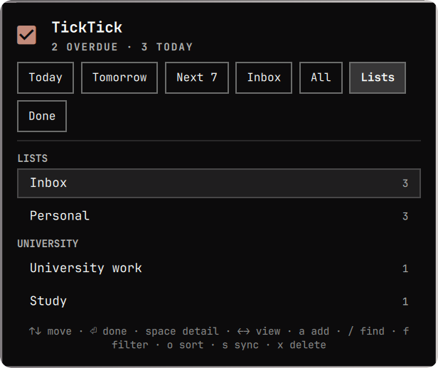

<p align="center">
  <picture>
    <source media="(prefers-color-scheme: dark)" srcset="docs/img/hero-dark.svg">
    <source media="(prefers-color-scheme: light)" srcset="docs/img/hero-light.svg">
    
  </picture>
</p>

<p align="center">
  <a href="https://github.com/EhsanulHaqueSiam/omarchy-ticktick/actions/workflows/ci.yml"></a>
  <a href="LICENSE"></a>
  <a href="https://omarchy.org/"></a>
  <a href="https://www.python.org/"></a>
  
</p>

<p align="center">
  <b>Your tasks in the bar.</b> Grouped by list, the way TickTick does it.<br>
  Every edit lands <b>instantly and locally</b>, then syncs in the background — so a
  train tunnel is not an outage.
</p>

<p align="center">
  <br>
  <sub>Overdue and due today, urgent-coloured when you are behind. Notes are not counted.</sub>
</p>

---

<table>
<tr>
<td width="34%" valign="top" align="center">
  <br>
  <sub><b>Sections are your lists.</b><br>Inbox · University work · Study · Personal</sub>
</td>
<td width="34%" valign="top" align="center">
  <br>
  <sub><b>Edit anything, from the keyboard.</b><br>Dates, tags, repeat, reminder, subtasks</sub>
</td>
<td width="32%" valign="top" align="center">
  <br>
  <sub><b>Lists nest under folders.</b><br>Just like the TickTick sidebar</sub>
</td>
</tr>
</table>

Sections follow the sort: **by list** is the default, the way TickTick groups a smart
list. <kbd>o</kbd> cycles to date (Overdue / Today / Tomorrow), priority or title.
Notes render with a **▤** and never reach the badge — only to-dos are counted.

## Install

**1 — add the plugin.**

```bash
omarchy plugin add https://github.com/EhsanulHaqueSiam/omarchy-ticktick.git --enable
```

That is a `git clone` into `~/.config/omarchy/plugins/siam.ticktick/` and nothing else —
no build step, no `pip install`, no daemon, no Node. The helper is standard-library
Python 3.11+, which Omarchy already has.

**2 — install the `ticktick` CLI.** The widget is a thin shell over it: everything the
popup does, it does by running this. It ships inside the plugin, and the widget always
calls it by its full path — but you want it on your `PATH` too, because it is how you
sign in from a terminal, script your tasks, and diagnose anything that goes wrong. Every
command in this README assumes it is there.

```bash
mkdir -p ~/.local/bin
ln -sf ~/.config/omarchy/plugins/siam.ticktick/bin/ticktick ~/.local/bin/ticktick
ticktick --version
```

**3 — sign in.** Click the widget → **Sign in with browser**. That is the whole setup.

<details>
<summary>Placing and updating the widget</summary>

```bash
omarchy bar plugin move siam.ticktick center   # left | center | right
omarchy plugin update siam.ticktick            # shows a diff, then fast-forwards
omarchy plugin remove siam.ticktick
```
</details>

## Signing in

**Sign in with browser** is the button the widget leads with. It opens a terminal,
sends you to TickTick in your browser, and catches the redirect back. The first run asks
once for a **Client ID** — TickTick issues no shared one, so every client needs an app of
its own:

1. open the [TickTick Developer Center](https://developer.ticktick.com/manage) → **New App**
2. set its redirect URI to exactly `http://localhost:8080/callback`
3. paste the Client ID when the terminal asks

No client secret is needed: the flow uses **PKCE**, because a secret shipped inside a
program on someone else's machine is not a secret. The id is remembered, so this is asked
once ever.

```bash
ticktick auth                                  # same flow, from a terminal
ticktick auth --redirect http://localhost:9000/callback
```

### Or paste an API token

Faster if you already have one, and the fallback if the browser flow cannot run — behind
**Paste an API token instead** in the widget. Get it from the TickTick web app: avatar →
**Settings → Account → API Token**.

```bash
ticktick login          # prompts, reads the token from stdin
ticktick status
```

The token is passed to the helper over **stdin**, never on the command line, because
anything in `argv` is readable by every process on the machine through
`/proc/<pid>/cmdline`. It is stored at `~/.config/ticktick/credentials.json`, mode
`0600`. Nothing is sent anywhere except `api.ticktick.com`.

**Already signed in to [TickTick's own CLI](https://www.npmjs.com/package/@ticktick/ticktick-cli)?**
Then you are already signed in here — its token is picked up automatically from
`~/.config/ticktick-cli/config.json`. That file is only ever read, never written, and
`ticktick logout` stops the borrowing for good.

<details>
<summary>Using dida365.com (滴答清单)?</summary>

It is a separate service with separate accounts and the same API shape. Point the
helper at it once, when you sign in:

```bash
ticktick login --api-base https://api.dida365.com/open/v1
```

`TICKTICK_API_BASE` in the environment overrides it for a single command.
</details>

## Using it

### Mouse

| Where | Action |
|---|---|
| Bar button | left = popup · right = refresh now · middle = jump to quick-add |
| Task row | click the checkbox = complete · click the title = expand detail |
| Finished row | ticked and struck through, dated by when you finished it; nothing to click, because TickTick's API cannot reopen it |
| Expanded detail | tick a subtask · remove one with the ✕ that appears · pick a list, repeat or reminder |
| Note row | opens like any other; it has no checkbox, because a note is not a task |

### Keyboard

The popup is fully keyboard-driven — the mouse is optional.

| Key | Action |
|---|---|
| <kbd>↑</kbd> <kbd>↓</kbd> / <kbd>k</kbd> <kbd>j</kbd> | move the cursor |
| <kbd>Enter</kbd> | complete the task under the cursor |
| <kbd>Space</kbd> | expand / collapse its detail |
| <kbd>←</kbd> <kbd>→</kbd> / <kbd>Tab</kbd> | switch view |
| <kbd>1</kbd>–<kbd>7</kbd> | jump to Today / Tomorrow / Next 7 / Inbox / All / Lists / Done |
| <kbd>a</kbd> | quick-add |
| <kbd>/</kbd> | search |
| <kbd>o</kbd> | cycle sort — list, date, priority, title (this also sets the headings) |
| <kbd>f</kbd> | filter by priority and tag; <kbd>Esc</kbd> clears it |
| <kbd>p</kbd> | cycle priority |
| <kbd>x</kbd> / <kbd>d</kbd> | delete (with confirmation) |
| <kbd>r</kbd> | refresh from the cache |
| <kbd>s</kbd> | sync — push anything queued and refetch now |
| <kbd>Esc</kbd> | back out one layer, then close |

<kbd>r</kbd> and <kbd>s</kbd> differ on purpose: reads are cache-first, so <kbd>r</kbd>
is instant and may serve what it already has. <kbd>s</kbd> is how you say *go and look*.

### Notes vs tasks

TickTick lets a list hold notes as well as tasks. A note has no checkbox and nothing to
finish, so it shows with a **▤** glyph, cannot be completed, and never counts toward the
bar badge, the section counts or a list's count. Only to-dos are counted.

### Editing a task

<kbd>Space</kbd> opens a task's detail, where everything about it is editable without
leaving the keyboard: due date and start date (in the same natural language quick-add
takes — `tomorrow 5pm`), tags, repeat, reminder, which list it belongs to, and its
subtasks. An empty due field committed with <kbd>Enter</kbd> clears the date.

### Natural-language quick add

Type a whole task in one line. Anything it does not recognise stays in the title
verbatim, so `call #1 supplier` is left alone rather than mangled.

```
submit report tomorrow 5pm !high #work
pay rent on the 1st !medium *monthly
dentist next tuesday 9:30am
review PR in 3 days
```

| Token | Meaning |
|---|---|
| `today` `tomorrow` `tonight` `mon`…`sun` `next monday` `in 3 days` `eod` `eow` `2026-08-14` `14 aug` | due date |
| `5pm` `5:30pm` `17:30` `@9am` `noon` `midnight` | time of day (without one, the task is all-day) |
| `!high` `!medium` `!low` `!none` (`!p1`…`!p0`) | priority |
| `#work` `#"two words"` | project (falls back to your default if unknown) |
| `*daily` `*weekly` `*monthly` `*weekdays` `*every 3 days` | repeat rule |

Preview the parse without creating anything:

```bash
ticktick parse "submit report tomorrow 5pm !high #work"
```

## The sync engine

Nothing you do here waits on the network. Every read is answered from a local cache and
every write is applied locally first, queued on disk, and sent when it can be:

```
 keystroke ──▶ local cache updated ──▶ on screen        (same frame)
                      │
                      └──▶ durable outbox ──▶ TickTick  (in the background)
                                                 │
                                    other devices see it
```

Add a task and the row is there **on the keystroke** — before the helper has even been
launched — because it is written to the cache first and the queue catches up. Tick
something off in a tunnel and it leaves the list immediately; the queue survives reboots
and drains on its own. Two rules make that safe:

- **A write the server has accepted is never sent twice**, and a write it has not is
  never dropped — not after a long outage, not behind a captive portal.
- **A queued edit never reverts a field it did not touch.** TickTick has no PATCH, so an
  edit that has been waiting re-reads the task before replacing it.

A task typed inside **Today** gets today's date, and one typed inside a list joins that
list — TickTick's own rule, and the reason a new task appears where you typed it instead
of in an undated list nobody is looking at.

```bash
ticktick complete <taskId> --offline   # apply now, send later
ticktick sync                          # flush the queue and refresh
ticktick status                        # "3 changes waiting to sync"
```

The cache lives at `~/.local/state/ticktick/state.json`, mode `0600`. Signing out
deletes it, because it holds your task titles.

Two consequences worth knowing:

- A task created offline gets a temporary id until it syncs, at which point it adopts
  the real one. Edits you made to it in the meantime follow it.
- If the server refuses a queued write on its own terms — the task was deleted from
  another device, say — that entry is dropped and the rest of the queue continues. A
  server *outage* is different: those stay queued and retry.

## The CLI

The widget is a thin shell over a real command-line tool. Everything the popup can do
you can do from a terminal, which is also what makes the whole thing debuggable.

It prints a formatted view to a terminal and **exactly one JSON object** to a pipe, so
the same command serves a human and the widget without a flag to remember.

Put it on your `PATH` if you have not already — [step 2 of Install](#install).

```bash
ticktick status                              # signed in? counts, pending writes
ticktick tasks --view today                  # due today + whatever is late
ticktick tasks --view tomorrow
ticktick tasks --view inbox                  # a list, so undated tasks show too
ticktick tasks --view next --days 14
ticktick tasks --sort time                   # list (default) | time | priority | title
ticktick tasks --tag errand --priority high
ticktick sync                                # push what is queued, then refetch
ticktick search invoice --all-states         # searches completed tasks too
ticktick add "submit report tomorrow 5pm !high #work"
ticktick add "call plumber" --tag urgent --start today
ticktick complete <taskId>
ticktick edit <taskId> --priority 3 --due "next monday 9am"
ticktick edit <taskId> --add-tag errand --remove-tag urgent
ticktick edit <taskId> --remind 30m --repeat "every 2 weeks"
ticktick edit <taskId> --clear-remind --clear-repeat
ticktick move <taskId> <toProjectId>

ticktick item add <taskId> "pack passport"   # checklists
ticktick item check <taskId> <itemId>
ticktick item rename <taskId> <itemId> "new title"
ticktick item move <taskId> <itemId> 0
ticktick item remove <taskId> <itemId>

ticktick completed --days 7
ticktick projects
ticktick project add "Reading" --color "#F18181"
ticktick project groups
ticktick tags
```

Add `--json` to force machine output on a terminal, `--text` to force the formatted
view through a pipe.

Every JSON-emitting subcommand exits 0 — including on failure
(`{"ok": false, "error": "auth", "message": "…"}`). That contract is what lets the QML
side parse it without ever seeing a traceback.

The shell also exposes IPC:

```bash
omarchy-shell siam.ticktick refresh
omarchy-shell siam.ticktick add "Buy milk tomorrow"
omarchy-shell siam.ticktick toggle
omarchy-shell siam.ticktick count
omarchy-shell siam.ticktick view next
```

## Settings

Configure through the Omarchy bar settings UI, or from a shell:

```bash
omarchy bar plugin set siam.ticktick refreshIntervalSec 120
omarchy bar plugin set siam.ticktick badgeMode Overdue
omarchy bar plugin set siam.ticktick hideWhenEmpty true --json
```

| Key | Type | Default | Meaning |
|---|---|---|---|
| `refreshIntervalSec` | 30–86400 | `300` | poll cadence; actions refresh immediately regardless |
| `upcomingDays` | 0–30 | `7` | how far the **Next 7** view reaches |
| `completedDays` | 1–90 | `7` | how far back **Done** looks |
| `badgeMode` | Today / Overdue / All / None | `Today` | what the bar number counts (never notes) |
| `sortBy` | List / Date / Priority / Title | `List` | row order, and therefore the section headings |
| `defaultView` | Today / Tomorrow / Next / Inbox / All / Lists / Completed | `Today` | which view the popup opens on |
| `defaultProject` | project id | `""` | where quick-add files tasks (blank = Inbox) |
| `hideWhenEmpty` | bool | `false` | remove the widget from the bar when the badge is 0 |
| `showProjectChips` | bool | `true` | show each task's project on its row, where the section heading does not already say it |
| `includeUndated` | bool | `false` | include tasks with no due date in **All** |
| `confirmDelete` | bool | `true` | confirm before deleting (deletion is permanent) |

## How it works

```
 bar  ─ qml/BarWidget.qml ─ qml/Service.qml ─┐
                                             │  Process + one JSON object per call
                                  bin/ticktick
                                             │
                      ticktick/{cli,store,views,api,…}.py
                                             │  cache + outbox on disk
                                             │  HTTPS
                                  api.ticktick.com/open/v1
```

QML never speaks HTTP — not even for signing in. Every bit of logic worth testing —
date bucketing, the language parser, grouping, sorting, the sync queue — lives in
Python behind `unittest`, and QML is left with presentation only. See
[docs/ARCHITECTURE.md](docs/ARCHITECTURE.md).

## TickTick API notes

Several behaviours were verified by executing against a live account, because the
published documentation is wrong or silent about them. If you are building your own
TickTick client, these will save you an afternoon:

- **The Open API is much bigger than its docs.** `GET /tag`, `GET /project/group`,
  `POST /task/search`, `GET /project/{id}/column`, `GET /habit` and `GET /countdown`
  all work and none are documented. Tasks carry `tags`, `parentId`/`childIds`,
  `sortOrder`, `startDate` and `progress`.
- **`POST /task/search` ignores half its own parameters.** `keywords` and `status` are
  honoured; `projectIds`, `dueFrom` and `dueTo` are accepted and have no effect. It
  does reach completed tasks, which `/task/filter` cannot.
- **Responses carry milliseconds** (`2026-07-31T18:00:00.000+0000`), which does not
  match the documented `yyyy-MM-dd'T'HH:mm:ssZ`. Parsing with `strptime` and that
  format raises on every date — and a parser that swallows the error renders every
  task as undated, silently.
- **All-day due dates are midnight in the *task's own* timezone.** Reading the UTC
  date shifts every all-day task by a day for anyone far enough from UTC.
- **A bare date string is silently discarded.** `{"dueDate": "2026-08-06"}` returns
  `200 OK` and the task comes back with `dueDate: null`.
- **`POST /task/filter` returns every task in one request**, Inbox included. The widely
  repeated "TickTick has no all-tasks endpoint" is out of date, and per-project fan-out
  is exactly what trips the rate limiter.
- **Rate limiting arrives as HTTP 500** with `exceed_query_limit` in the body, not a 429.
- **The Inbox is absent from `GET /project`** but reachable at `GET /project/inbox/data`.
- **There is no PATCH.** Every task update replaces the whole task, so any client must
  send back the fields it did not mean to change — including the entire checklist.

### Limitations

These are TickTick's, not the plugin's:

- A completed task **cannot be un-completed** — no endpoint exists. Undo it in the app.
- No webhooks, so the widget polls.
- Attachments and sharing are not exposed.

Habits, focus/pomodoro records and countdowns do have endpoints, but they are not a
to-do list and this widget deliberately leaves them alone.

## Troubleshooting

**The widget shows nothing / the slot is blank.** That is a QML load error. Check the
plugin is discovered and enabled:

```bash
omarchy plugin list | grep ticktick
omarchy plugin rescan
```

**The count is 0 but I have tasks.** Ask the helper directly:

```bash
ticktick tasks --view all --refresh
```

Undated tasks are never counted — the widget is a due-date view by design. Turn on
`includeUndated` to see them in **All**.

**Changes are not appearing on my phone.** Check the queue:

```bash
ticktick sync
```

If it reports a rate limit, that is TickTick throttling you; the backoff is remembered
across runs and it will drain on its own.

**"Not signed in" after it worked.** The credential lapsed. Run `ticktick auth` again,
or generate a fresh token under Settings → Account → API Token and paste it in. Nothing
queued is lost by signing back in — the outbox is on disk and flushes on the next
successful call.

**A new task takes a moment to show its real due date.** The row appears instantly from
the local cache with what you typed; the parsed date, list and priority land a moment
later when the write is confirmed. If it never resolves, `ticktick sync` will say why.

**Two TickTick widgets, one stops responding to `omarchy-shell`.** An IPC target
accepts one handler; the first to register wins. Remove the other plugin, or use the
bar button.

## Contributing

See [CONTRIBUTING.md](CONTRIBUTING.md). Standard library only, and logic that can be
tested belongs in Python rather than QML.

```bash
python -m unittest discover -s tests   # 215 tests, no network
node --test tests/model.test.js        # the QML presentation helpers
python tests/validate_manifest.py
python tests/validate_qml_api.py
./tests/qml_smoke.sh                   # needs a live Omarchy session
./tests/screenshots.sh                 # re-renders the images above
```

## License

MIT — see [LICENSE](LICENSE).

Not affiliated with or endorsed by TickTick or Appest Inc.
